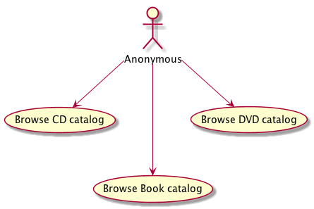
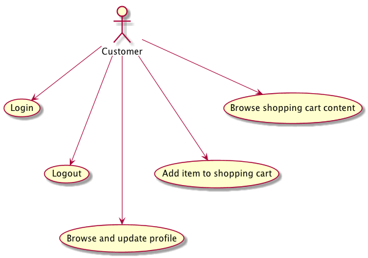
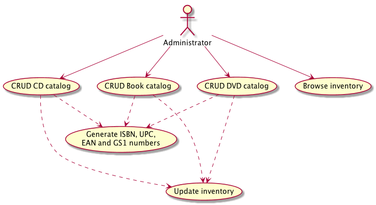

# Baking a Microservice Pi(e)

This is the code of the demos for the "Baking a Microservice Pie" talk given by [@radcortez](https://twitter.com/radcortez) and [@agoncal](https://twitter.com/agoncal).

The idea of the talk and the code, is to slowly build an entire microservice architecture (and deploy it on a cluster of Raspberry Pi). It is a DVD/CD/Book store where you can search for items, buy them (using a shopping cart) and see the inventory stock.

Its genesis comes from the [Tomitribe](http://www.tomitribe.com/) talk: [Microprofile JCache](https://github.com/tomitribe/microprofile-jcache)

## Use cases

### Anonymous user

Anybody can browse the catalog of CDs, Books and DVDs.



### Customers

Once logged-in, an anonymous user becomes a customer. A customer can add, remove, browse and check-out the items of his/her shopping cart. The customer can also change his/her profile. Each time items are sold, the inventory is updated.



### Administrators

Administrators can create, update, delete items (CDs, DVDs, Books). A new item needs a number (ISBN, UPC, EAN or GS1). Each time an items is created of deleted, the inventory is updated.



## Architecture 

### Technology used

### Raspberry Pi cluster

## Structure of the GitHub repository 

### Structure of the demos

This talk has several demos. Each one builds on top of the other. For example, `Demo02` is built on `Demo01` but brings the solution to a problem (eg. _How do we register microservices ?_). The last `Demo` folder (.i.e `Demo99`) is the final application, up and running.

* `Demo01` : We build several microservices (DVD, CD, Book, ShoppingCart, NumberGenerator and Inventory). Each service depends on another one. _Problem: The URLs are hard coded._
* `Demo02` : We add a registry service so that each microservice car register itself and discover the others. _Problem: How can we scale._
* `Demo03` : We need a client load-balancer so each microservice can choose from several instances of another service. _Problem: Now we have services everywhere, how do we monitor them._
* `Demo05` : We need centralized monitoring. _Problem: we need to secure these services with JWT in a centralize way._
* `Demo06` : We need a centralized gateway dealing with authentication. _Problem: under load, some services do not answer and block the other._
* `Demo07` : We need to implement the circuit breaker pattern. _Problem: Debugging is hard, we are lost between all services calls._
* `Demo08` : We need a tracking system
* `Demo99` : Final application

### Structure of the code 

```
+-- services
|   +-- book-api
|   |     +-- src
|   |       +-- main
|   |       +-- test
|   +-- cd-api
|   +-- dvd-api
|   +-- shoppingcart-api
|   +-- number-api
|   +-- monitoring
|   +-- registry
|   +-- tracing
|   +-- health
+-- clients
|   +-- angular application
|   +-- jax rs client to test services
|   +-- curl commands
+-- deployment
|   +-- ansible scripts
|   +-- docker config
```

## Tools

When testing on Chrome, use this plugin to disable CORS (otherwise, it's painful)

https://chrome.google.com/webstore/detail/allow-control-allow-origi/nlfbmbojpeacfghkpbjhddihlkkiljbi?utm_source=chrome-app-launcher-info-dialog


## References

* [https://github.com/Bjond/ribbon-resteasy-poc](ribbon-resteasy-poc)